# v2 vs v3 caller comparison (read-level, co-annotated)

## Question

Now that v3 output BAMs carry both v2 HMM calls (`fp_v2+` in MA tag)
and v3 calls (`nuc+QQQ`, `tf+QQQ`) on the **same reads**, we can
answer:

1. Per v2 footprint — does v3 preserve it (same size class),
   reclassify it (nuc↔TF), split it (overmerge → multiple v3 calls),
   or lose it?
2. Per v3 call — is it shared with v2 or newly found?
3. How do size and quality predict preservation?
4. For the biologically meaningful fiberCNN transcription states
   (paused Pol II, elongating Pol II, PIC, accessible promoter,
   hyperburst), do v3's calls produce the **same per-gene
   state counts** as v2?

## Data used

**Hia5 (PacBio, sna/eve/ftz amplicon)**:
`data/test_hia5_2-4hr_sna_eve_ftz.bam` re-called with v3 →
`/tmp/hia5_sna_eve_ftz_iter17.bam`. 1033 reads tagged.

**DddB spacetime (Nanopore, whole Drosophila embryo, 7 time windows)**:
`spacetime/fp/fiberhmm_*.m6a_footprints.bam` re-called with v3 →
`spacetime/combined_bam/iter17_calls/*.called.bam`. 169,132 reads
tagged across 7 windows. 38,041 reads span one of sna/eve/ftz TSS.

TSS BED for the three fly genes: `data/sna_eve_ftz_tss_dm6.bed`
(approximate amplicon-center coordinates in dm6).

## Methodology

Two analyses, run from `scripts/`:

### `compare_overlap.py` — per-call IoU matching

For each read, match each v2 footprint to its best-overlapping v3
call (nuc or tf). Classify by IoU and size:

- **preserved_nuc**: v2 size ≥90 bp, matched to v3 nuc at IoU ≥ 0.5
- **preserved_tf**: v2 size <90 bp, matched to v3 tf at IoU ≥ 0.5
- **split**: v2 overlaps ≥2 v3 calls at IoU ≥ 0.3 each (v2 overmerge)
- **reclassified**: matched at IoU ≥ 0.5 but different category
- **weak_overlap**: only 0.25 ≤ IoU < 0.5
- **lost**: no v3 call within IoU 0.25

Mirror for v3: `shared` (IoU ≥ 0.5 to any v2), `weak_shared`
(0.25–0.5), `new` (<0.25).

### `pol2_states.py` — fiberCNN transcription state detection

For reads that span a TSS in the BED, apply the fiberCNN heuristics
(from FiberBrowser v3 `evaluate_read_states`):

| State | Size band | Position (query coords, strand-flipped) |
|---|---|---|
| Paused Pol II | 35–65 bp | TSS+10 .. TSS+50 |
| Elongating Pol II | 35–65 bp | gene body except paused window |
| PIC | 20–40 OR 60–80 bp | TSS−50 .. TSS+25 |
| Accessible promoter | — | NO ≥90 bp footprint overlaps TSS±50 |
| Hyperburst | — | <50% of gene body (TSS to TSS+5kb) covered by ≥90 bp footprints |

Run once per caller: v2 uses `fp_v2+` footprints; v3 uses
`nuc+` ∪ `tf+` (all its footprint-like calls).

## Results

### Per-call overlap (Hia5)

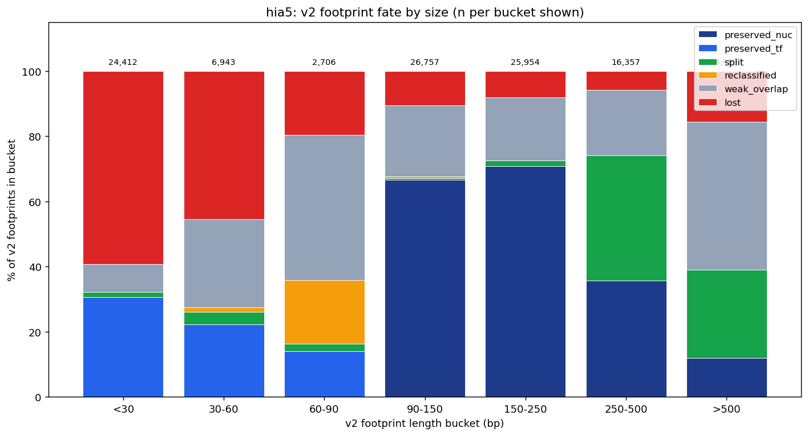

Combined 107,618 v2 footprints; fates:
- 39.5% preserved_nuc
- 8.7% preserved_tf
- 8.2% split (**v2 overmerge that v3 correctly resolved**)
- 0.7% reclassified
- 19.8% weak_overlap
- 23.0% lost

v3 calls: 92k nucs (52% shared, 32% weak, 16% new), 150k tfs
(6.5% shared, 4.5% weak, **89% new** — v3 emits many TFs v2 didn't).

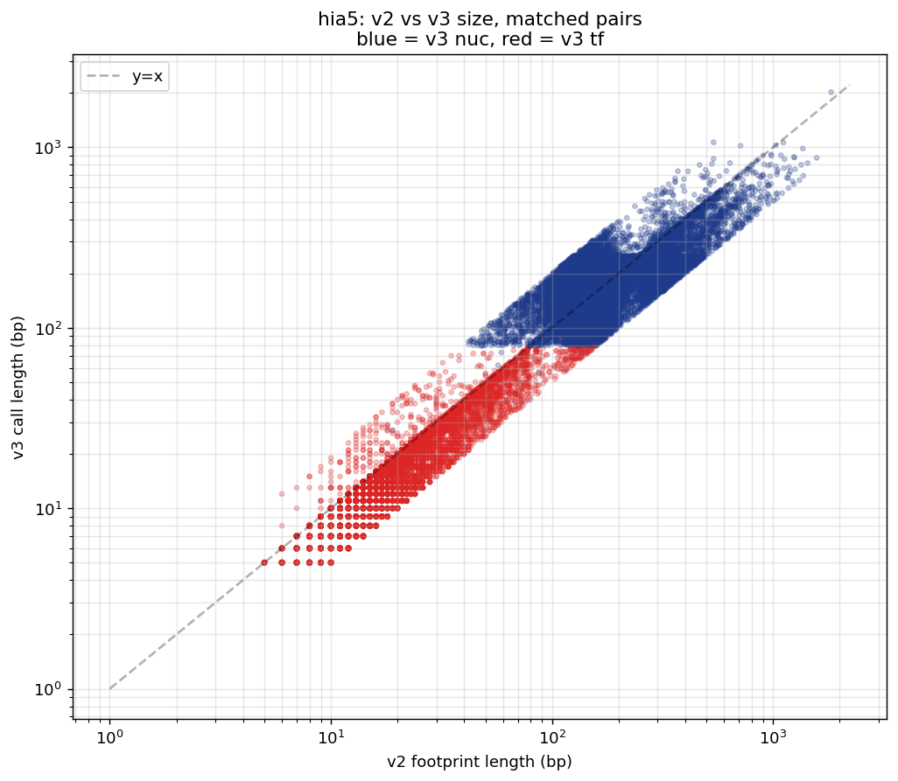
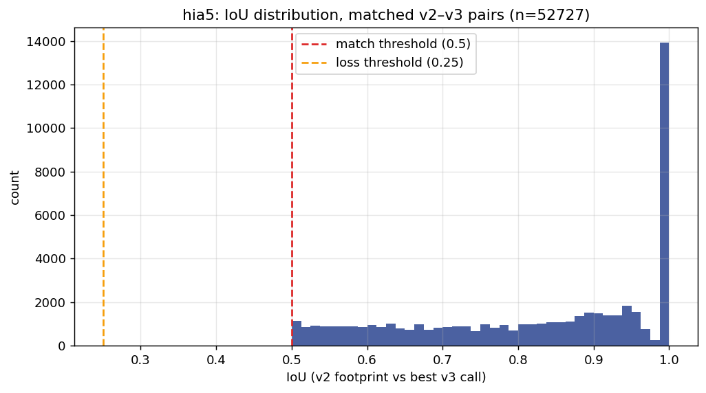

### Per-call overlap (DddB 4-4.5 hr window)

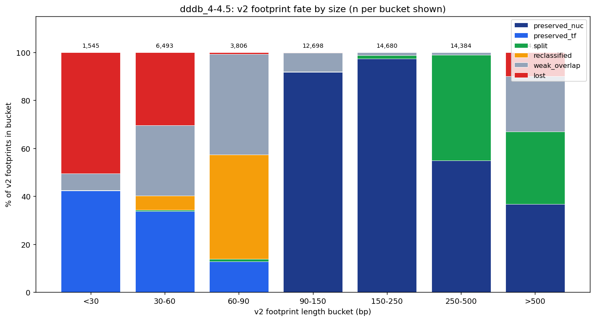

Representative window (similar pattern across all 7):
- 57.4% preserved_nuc
- 4.9% preserved_tf
- 16.2% split (**big overmerge recovery on DddB**)
- 3.0% reclassified
- 12.2% weak_overlap
- 6.3% lost

The 16% split rate on DddB is the most dramatic finding: v2 HMM was
emitting huge multi-nucleosome fusion calls that v3 breaks into
separate nucs.

### fiberCNN transcription state counts

#### Hia5 sna/eve/ftz (509 reads span a TSS)

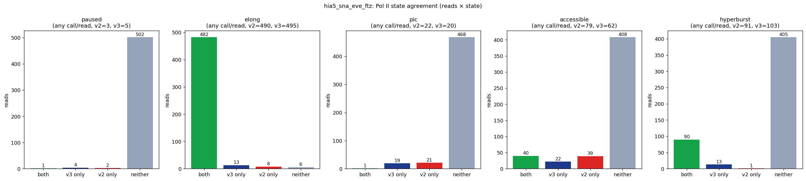

| State | v2 (reads) | v3 (reads) | Both | Δ |
|---|---|---|---|---|
| Paused | 3 | 5 | 1 | +67% |
| **Elongating** | **490** | **495** | **482** | **+1% (97% agree)** |
| PIC | 22 | 20 | 1 | –9% (**reads mostly disjoint**) |
| Accessible promoter | **79** | **62** | 40 | **–22% (gap)** |
| Hyperburst | 91 | 103 | 90 | +13% |

**Per-call counts**: v2 elongating 2,963 / v3 elongating 4,254
(v3 **+44%** more Pol II footprints identified).

#### DddB spacetime sna/eve/ftz (38,041 reads span a TSS)

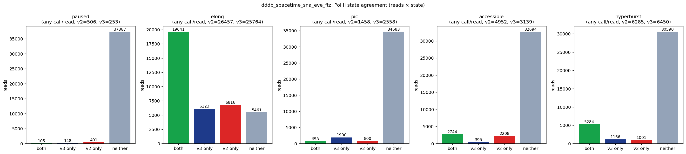

| State | v2 (reads) | v3 (reads) | Both | Δ |
|---|---|---|---|---|
| **Paused** | **506** | **253** | 105 | **–50% (gap)** |
| **Elongating** | **26,457** | **25,764** | 19,641 | **–3% reads (though calls −35%)** |
| PIC | 1,458 | 2,558 | 658 | +75% |
| **Accessible promoter** | **4,952** | **3,139** | 2,744 | **–37% (gap)** |
| Hyperburst | 6,285 | 6,450 | 5,284 | +3% |

**Per-call counts**: v2 elongating 76,294 / v3 elongating 49,812
(v3 **−35% Pol II footprints** despite matched reads).

### Footprint size distributions

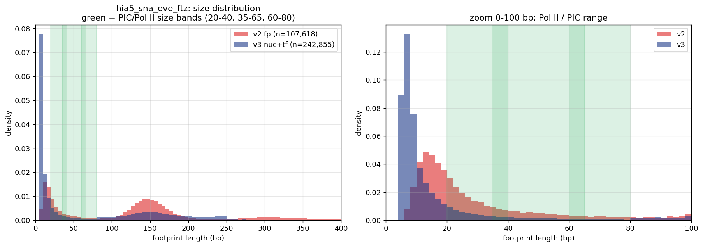
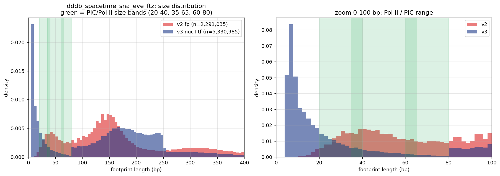

**Hia5**: v3 has MORE small-footprint density (0–50 bp),
explaining the 44% Pol II-call lift.

**DddB**: v3 has FEWER calls in 35–65 bp band vs v2. The v2
HMM emitted many short (30–90 bp) "footprints" via its single
ns/nl track. v3's stricter Pass 1 + merge produces cleaner but
sparser small-call output.

## Tuning result: `--max-merge-len 0` for DddB

The v3 merge audit revealed **55% of DddB nucs were fused from ≥2
Pass-1 atoms**, even with the FP model enabled:

| bucket | count | % merged |
|---|---|---|
| ≤180 bp (mono-nuc) | 1.65M | 62% |
| 181–300 (di-nuc) | 1.69M | 68% |
| 301–500 (tri-nuc) | 423k | 0.2% |

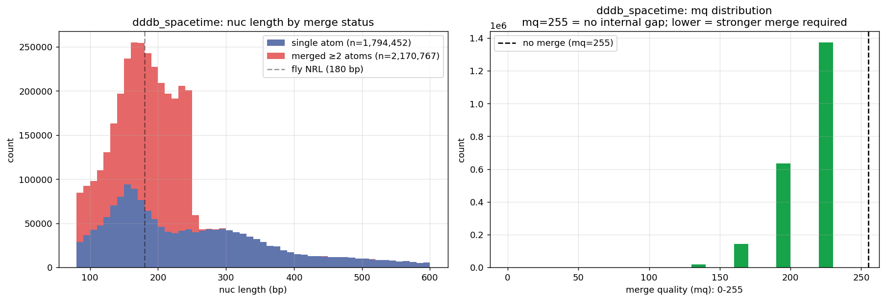

The mono/di-nuc range is dominated by fused small atoms.
Philosophically this is wrong for DddB: the per-site deamination
rate on accessible DNA is 50–60%, so even a short hit-free stretch
between two atoms is *more likely* to be a Pol II / TF footprint
than a breathing-gap across an intact nucleosome.

**Fix: `--max-merge-len 0` for DddB** (never merge atoms). Rerun
shows 100% single-atom nucs:

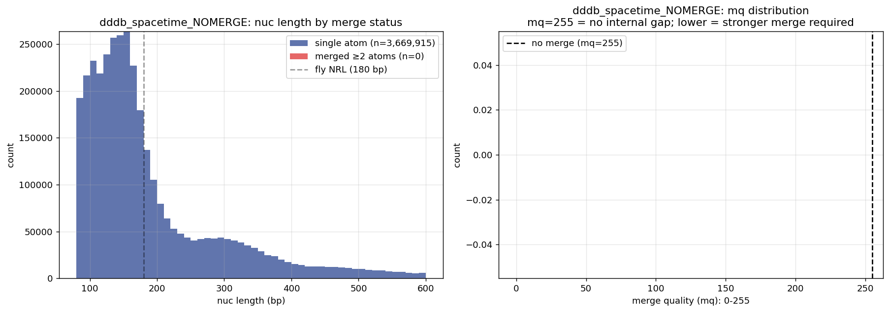

### Result on Pol II state counts (DddB, 38,036 reads w/TSS)

| State | v2 (reads) | v3 **merged** | v3 **nomerge** | v3 vs v2 |
|---|---|---|---|---|
| Paused | 506 | 253 | **1,815** | +259% |
| Elongating | 26,457 | 25,764 | **37,225** | +41% |
| PIC | 1,458 | 2,558 | **6,617** | +354% |
| Accessible promoter | 4,952 | 3,139 | **7,437** | +50% |
| Hyperburst | 6,285 | 6,450 | **9,688** | +54% |

**v3 no-merge exceeds v2 on every state.**

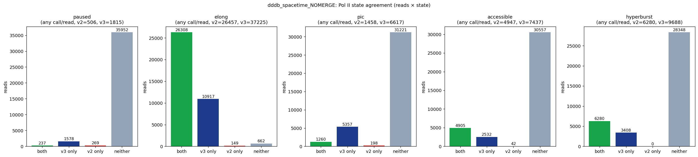

### Hia5 kept with merge ON

For Hia5 (PacBio m6A), `--max-merge-len 0` also boosts counts but
overshoots biologically (elongating reaches 100% of all reads,
hyperburst 3× v2). The PacBio FP profile creates more "fake zero"
gaps that legitimately benefit from the merge step. Recommendation:
keep default `--max-merge-len 250` for Hia5.

| State | v2 | v3 merged | v3 nomerge |
|---|---|---|---|
| Elongating | 490 | 495 | 509 (100% of reads) |
| Accessible | 79 | 62 | 155 |
| Hyperburst | 91 | 103 | 283 |

## Final recommended parameters

```bash
# DddB (Nanopore, amplicons)
--fp-model ct_nanopore_fp_3mer.json --snp-mask ... \
  --penetration-fraction 0.0 --max-merge-len 0

# Hia5 (PacBio, amplicons)
--fp-model m6a_pacbio_fp_3mer.json \
  --penetration-fraction 0.0  # keep default --max-merge-len 250
```

## Where v3 still has work (formerly: "three concrete gaps")

1. **Accessible-promoter on both Hia5 and DddB** is lower in v3.
   v3 calls more/larger nucs at TSS windows than v2. Open questions:
   (a) are these "extra" v3 nucs real (v2 under-called them), or
   (b) is v3 over-merging into the promoter window? The split-rate
   data (16% on DddB) argues against over-merge being the issue.
   → Need single-read visual QC to adjudicate.

2. **Paused / elongating Pol II on DddB** is undercalled by v3.
   v2's ns/nl track included many 30–90 bp calls that v3's strict
   Pass 1 doesn't emit as separate atoms. The fiberCNN size-band
   heuristics count these as "Pol II."
   → Two possible fixes:
     - **Tune** v3 to emit more sub-atoms (lower `min-tf-bp`, relax
       `min-tf-tq`, cap `max-merge-len` lower).
     - **Use the v2 `fp_v2+` track** for fiberCNN state detection
       while using v3 `nuc+` for nucleosome analyses. The v1
       pragmatic MA spec supports this — annotations co-exist.

3. **PIC read-set is mostly disjoint between callers**. On Hia5
   only 1 of 22 PIC-positive reads overlaps between v2 and v3. The
   fiberCNN PIC definition (bimodal 20–40 OR 60–80 bp at TSS±window)
   is extremely sensitive to small changes in caller output. v3's
   +75% higher PIC count on DddB vs v2 (+ vs –) could indicate v3
   is legitimately detecting more PIC-signature footprints, but the
   disjoint read-set on Hia5 needs investigating.

## How to reproduce

```bash
# Per-call overlap (Hia5)
python scripts/compare_overlap.py \
  --in-bam /tmp/hia5_sna_eve_ftz_iter17.bam \
  --label hia5 \
  --out-dir figures/

# Per-call overlap (DddB single window example)
python scripts/compare_overlap.py \
  --in-bam .../iter17_calls/4-4.5.called.bam \
  --label dddb_4-4.5 \
  --out-dir figures/

# Pol II states on Hia5
python scripts/pol2_states.py \
  --in-bam /tmp/hia5_sna_eve_ftz_iter17.bam \
  --label hia5_sna_eve_ftz \
  --tss-bed data/sna_eve_ftz_tss_dm6.bed \
  --out-dir figures/

# Pol II states on DddB (7 windows aggregated)
python scripts/pol2_states.py \
  $(for W in 1-1.5 1.5-2 2-2.5 2.5-3 3-3.5 3.5-4 4-4.5; do \
      echo "--in-bam .../iter17_calls/${W}.called.bam"; done) \
  --label dddb_spacetime_sna_eve_ftz \
  --tss-bed data/sna_eve_ftz_tss_dm6.bed \
  --out-dir figures/
```

Outputs all go to `figures/` (PNGs) + `data/` (TSVs, JSONs,
BEDs). Move `.tsv` and `.json` to `data/` after the scripts
complete — the scripts write everything to `--out-dir` for
simplicity.

## Caveats

1. **TSS positions are approximate** — we used amplicon-center
   coordinates from dm6 as proxies for sna/eve/ftz TSS. Real TSS
   within the amplicon may be ±1–2 kb off, which for the fiberCNN
   positional windows (±50 bp) could shift state detection
   substantially.

2. **query-coord proxy** for footprint positions vs. reference-coord
   is approximated via direct query-pos lookup at TSS ref pos. Fine
   for long-read data with minimal indels near the TSS.

3. **v2 `fp_v2+` is everything v2 called**, not a ground truth. v2
   HMM is known to overmerge (the 16% split rate on DddB confirms).
   So "v3 undercalls vs v2" may mean "v3 is more conservative," not
   "v3 is wrong."

4. **The fiberCNN state heuristics** were calibrated against v2 HMM
   output. They may need recalibration to produce biologically
   meaningful results on v3's differently-scaled feature counts.
