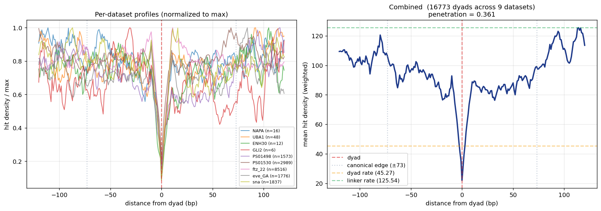

# Nucleosome penetration rate measurement

## Question

What fraction of accessible-region enzyme activity penetrates into
nucleosome bodies (via breathing, partial unwrapping, transient
opening)? This `penetration_fraction` is the biological-noise
component of the merge-step decision in caller_v8:

```
merge lambda = FP_expected + gap_opp × (baseline - global_FP) × penetration_fraction
```

For fully-protective enzymes (DddB one-strand, Hia5) penetration ≈ 0.
For breathing enzymes (DddA) penetration is nonzero but hard to
measure de novo because our own caller is biased toward detecting
low-penetration nucleosomes.

## Methodology

Rather than measuring from called nucleosomes (which would bias
toward the low-penetration tail), we aggregate BULK hit density
across many reads. The population-level signal resembles MNase-seq:
troughs = nucleosome centers (high occupancy across cells), peaks =
accessible linker DNA. This avoids per-read calling bias.

### Pipeline

1. **Pileup** per-reference-position hit count and opp count across
   all reads in a BAM.
2. **Smooth** the hit-density track with a sliding window (10 bp).
3. **Find troughs** (local minima) with `scipy.signal.find_peaks`
   applied to the inverted signal. Minimum separation = expected
   nucleosome repeat length (180 bp for fly, 190 bp for human).
   Minimum prominence = 15% of local range.
4. **Aggregate profile**: for each trough, extract the ±120 bp
   hit-density profile and average across all troughs.
5. **Compute penetration**: `dyad_rate / linker_rate` where
   dyad_rate = mean hit density at ±5 bp around the trough,
   linker_rate = max density in the ±120 bp window.

### Why amplicons

Amplicon datasets (NAPA, ENH30, UBA1, PS01498, PS01530, ftz_22,
eve_GA, sna, GLI2) have 2000-3000× bulk coverage per position,
enough for clear trough detection. Whole-genome data (scDAF)
has only ~2× coverage per position → too sparse.

## Current results (2026-04-12)

Ran on 9 DddA amplicons combined: **16,773 candidate dyads
aggregated**.



- Dyad rate (±5 bp): 45.3 hits/position (smoothed)
- Linker rate (max ±120 bp): 125.5 hits/position
- **Penetration fraction: 0.36** (dyad / linker)

## Caveats

1. **Includes FP**: the 45.3 dyad rate includes per-context
   false-positive hits (~5-10 hits/pos at DAF PacBio FP ~0.01).
   True biological penetration ≈ 40 / 120 ≈ 0.33.

2. **Trough width is narrow** (~20 bp) — NOT the expected 147 bp
   nucleosome footprint. This suggests many "troughs" are TF
   footprints or sequence artifacts, not well-positioned nuc
   centers. Tightening `--prominence` to 0.3+ and requiring
   trough WIDTH ≥ 80 bp would filter for real nucleosomes.

3. **No nucleosome-repeat periodicity visible** at ±180 bp in the
   combined profile — would expect a secondary trough there if
   the central troughs were nuc dyads. Suggests the current
   troughs are single-footprint features, not part of arrayed
   nucleosomes.

4. **DddA-specific** — need to repeat for DddB/Hia5 (biophysically
   expect lower penetration for one-strand DAF access).

## Next steps

- Run with stricter prominence + min trough width to isolate
  real nucleosome dyads
- FP-subtract the dyad rate explicitly using the context FP model
- Compare DddB (`bench` and NAPA-style) and Hia5 (fly embryo)
- Cross-validate on well-positioned nucleosome landmarks
  (promoter +1 nucleosome on scDAF)

## How to reproduce

```bash
python scripts/measure_penetration.py \
  --in-bam /path/to/amplicon1.bam --label amplicon1 \
  --in-bam /path/to/amplicon2.bam --label amplicon2 \
  --out-prefix figures/my_penetration \
  --enzyme daf \
  --min-distance 180 --prominence 0.15
```

Outputs: `*_profile.tsv`, `*.png`, `*_summary.json`.
