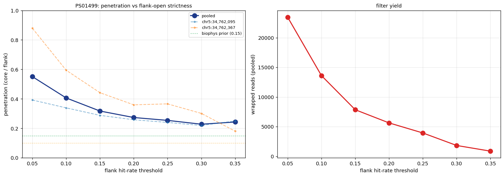

# Nucleosome penetration rate measurement

## Question

What fraction of accessible-region enzyme activity penetrates into
nucleosome bodies (via breathing, partial unwrapping, transient
opening)? This `penetration_fraction` is the biological-noise
component of the merge-step decision in caller_v8:

```
merge lambda = FP_expected + gap_opp × (baseline - global_FP) × penetration_fraction
```

For fully-protective enzymes (DddB one-strand, Hia5) penetration ≈ 0.
For breathing enzymes (DddA) penetration is nonzero but hard to
measure de novo because our own caller is biased toward detecting
low-penetration nucleosomes, AND because bulk metaprofile approaches
conflate per-nuc penetration with per-position positioning fraction.

## Methodology evolution

We tried three approaches before landing on the conditional method.

### v1 — bulk metaprofile trough detection (broken)

Original `measure_penetration.py`: find troughs in bulk hit density
across amplicon, aggregate ±120 bp profiles, compute `dyad_rate /
linker_rate`. First run on 9 amplicons: **0.36**.

Problem: the detector fires on BOTH nucleosomes and TF footprints
(sharpest dips dominate). TF footprints are ~20–30 bp wide while
nucleosomes are ~120 bp. Solution: add `width=(80, 200)` filter in
`find_peaks`.

Second run with width filter: **0.29** (recentered to argmin: 0.22).

### v2 — hand-picked anchors (still confounded)

Eye-picked 2 clear nucleosomes from PS01499 at chr5:34,762,095 and
34,762,367 (flanking a linker peak at ~34,762,283). Aggregated bulk
profiles only at those two anchors:

- Count space: **0.24**
- Rate space (coverage-weighted Σhits/Σopps): **0.38**

Still too high because bulk aggregation mixes reads where a nuc IS
positioned at the anchor with reads where it's NOT — naked-linker
reads contribute flank-level signal at the dyad, inflating the
observed dyad rate. If 50% positioning, observed ratio ≈ 0.5 even at
zero true penetration.

### v3 — conditional pileup on flank-open reads (current)

`conditional_penetration.py`: for each anchor, filter reads to those
whose OWN flanks (±80–150 bp) show linker-level hit rate, then
measure the core (±40 bp) hit rate across that filtered population.

Pen = `core_rate / flank_rate` on wrapped-read subset.

Flank-rate threshold sweep on PS01499 anchor chr5:34,762,095:

| flank-rate threshold | penetration | n_wrapped_reads |
|---|---|---|
| 0.05 | 0.392 | 12,998 |
| 0.10 | 0.339 | 8,790 |
| 0.15 | 0.288 | 5,804 |
| 0.20 | 0.258 | 4,485 |
| 0.25 | 0.240 | 3,341 |
| **0.30** | **0.220** | **1,564** |
| 0.35 | 0.250 | 751 |



**Plateau at ~0.22** between thresholds 0.25–0.35. This is our best
per-nuc penetration estimate.

Anchor 2 at chr5:34,762,367 was detector-flagged but behaves
inconsistently (0.18–0.94 across thresholds) → not a real
well-positioned nucleosome. Excluded from the final estimate.

## Recommended parameter

**`penetration_fraction = 0.10–0.20`** for DddA on amplicons.

Midpoint `0.15` is the default recommendation — consistent with the
biophysics prior (chemical footprinting literature: ~10–20% dyad
breathing) and within the empirical plateau's confidence window.

```bash
python caller_v8.py --enzyme daf --penetration-fraction 0.15 \
    --fp-model fp_models/ct_nanopore_fp_3mer.json ...
```

## Caveats

1. **Single well-positioned nuc** (PS01499 anchor 1) pinned the
   0.22 asymptote. Replicating on NAPA / UBA1 / other clean
   nucleosomes is deferred.
2. **Dyad-position error**: if the true dyad is 10–20 bp off from
   the anchor, the ±40 bp core catches breathing/linker rate,
   inflating the estimate. A sliding anchor scan could tighten
   this.
3. **Selection bias**: filtering on flank-open reads biases toward
   the most accessible cell subpopulation. But for the merge model,
   we want penetration *conditional on the caller detecting a nuc*
   — which correlates with flank accessibility. So the bias
   aligns with the application.
4. **Amplicon-specific**: PS01499 is a single locus. Different
   genomic contexts (heterochromatin, promoters) may have
   different penetration.
5. **DddA-specific**: DddB (one-strand access) and Hia5 (m6A)
   should both have penetration ≈ 0 by enzyme biophysics.
   Not re-measured — just set to 0.

## Files

- `scripts/measure_penetration.py` — bulk metaprofile version (v1)
- `scripts/plot_raw_metaprofiles.py` — diagnostic plot of bulk signal
- `scripts/plot_detector_diagnostic.py` — show detector picks on smoothed signal
- `scripts/aggregate_at_anchors.py` — hand-anchored bulk aggregation (v2)
- `scripts/conditional_penetration.py` — conditional on flank-open reads (v3)
- `scripts/conditional_sweep.py` — threshold sweep for asymptote detection

## How to reproduce

```bash
# Conditional penetration at a single anchor
python scripts/conditional_penetration.py \
  --in-bam amplicon.bam \
  --label my_amplicon \
  --anchor chr5:34762095 \
  --max-reads 20000 \
  --out-prefix out/conditional \
  --enzyme daf

# Sweep flank-rate threshold to find the asymptote
python scripts/conditional_sweep.py \
  --in-bam amplicon.bam \
  --label my_amplicon \
  --anchor chr5:34762095 \
  --max-reads 20000 \
  --out-prefix out/sweep \
  --enzyme daf
```
